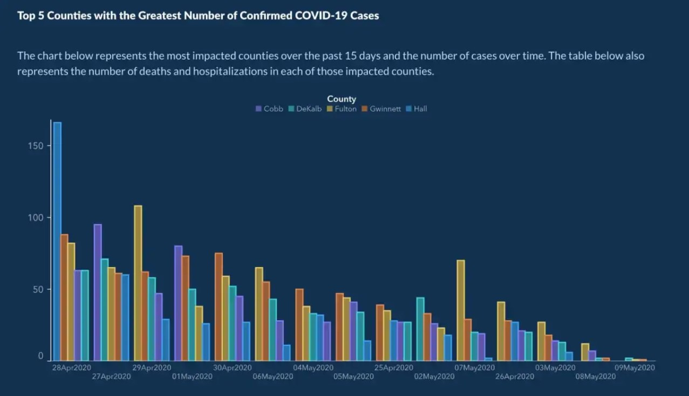
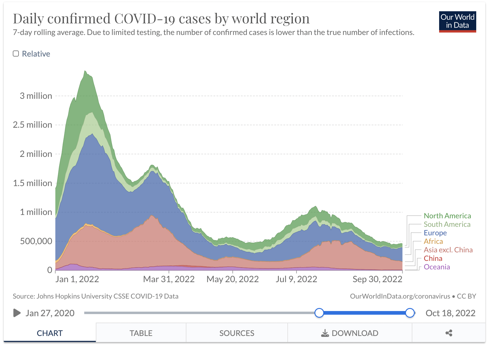
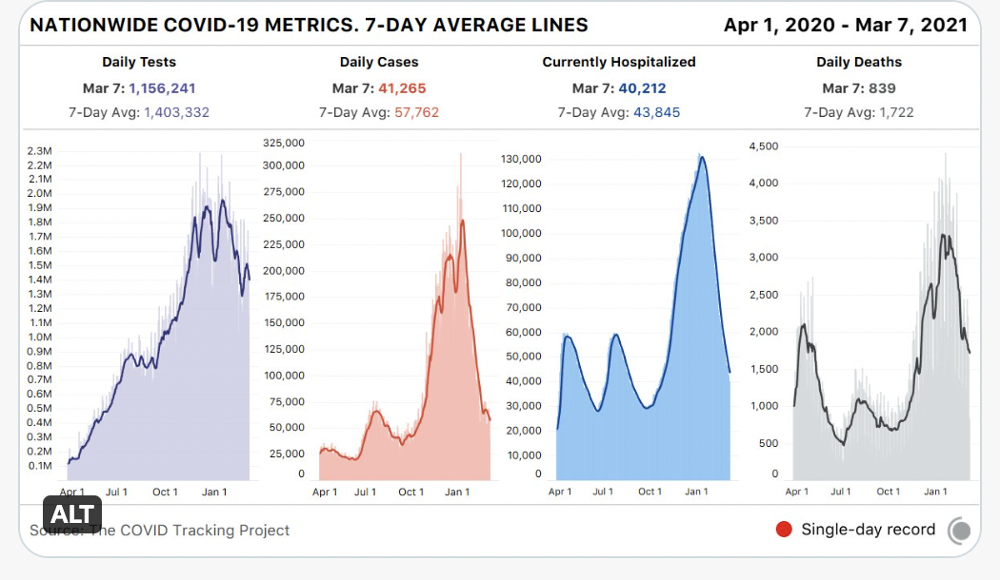

```{r setup, include=FALSE}
knitr::opts_chunk$set(echo = TRUE)
library(tidyverse)
library(dplyr)
```

# COVID-19 Infection Rates: An Analysis and Comparison Across Multiple Plots

## Overview

We are interested in COVID-19 infection rates because this is our world today. COVID-19 is present in our everyday lives. We want to see how rates are changing because we are "normalized now" and don't hear much about the virus even though it's still very present. We would like to study and replicate graphs that show a variety of locations at different times in the pandemic. All of us saw this virus unfold in front of us, so we thought it would be intriguing to compare the differences in spread. 

In our analysis, we will study and replicate three separate graphs on COVID-19. At the end, we will compare them to determine which qualities of each were effective or not effective.

# COVID-19 in Georgia - Original Graph

One graph that we found is pictured below and was taken from an article critiquing a graph from a past [COVID-19 in Georgia report](https://www.covid-georgia.com/archive/did-georgia-graph-cases-with-the-dates-out-of-order/) from the Georgia Department of Public Health (GA DPH). The author shows two graphs, the first being the non-chronological graph posted first, and the second being the corrected graph posted one week later.

```{r original-plot, echo=FALSE}

```
This is the corrected graph by the GA DPH posted one week after the misleading one was published. The original graph listed days non-chronologically, ultimately to give the appearance that the number of deaths and hospitalizations in the most affected counties in Georgia were steadily declining.

The manner of this corrected graph is what we will replicate, but we will alter it to map countries instead of counties in Georgia. 

## The Claim

The claim from the article is that a graphic posted on the Georgia Department of Public Health's website was inaccurately made and did not effectively display the number of deaths and hospitalizations over time. It showed cases steadily declining—assuming that dates were listed chronologically—but they weren't. 

The author, Kelley, writes:
> "This is of course insane. Nobody makes graphs with dates in a non-chronological fashion. It’s just wrong. I was very glad to see they fixed it promptly."

The article notices that there were declining COVID-19-related deaths and hospitalizations when the data is displayed chronologically over the 15 days measured, but the real decline is unlike the one shown in the original graph. While there are other corrections that she would still make to the second GA DPH graph, she believes that the second tells the story of COVID-related deaths and hospitalizations much more clearly.

We would like to use the data collected and study a different question: How does COVID-19 infection rates differ country to country over a time frame? 

## Design

The author of the GA DPH graphs chose to use a side-by-side bar graph to compare the reported COVID-19 cases in counties in Georgia over time. The author may have chosen this graph because bar charts are effective for visualizing count variables with categorical variables. 

There are three variables displayed in this visualization: the date that the data was collected, the deaths and hospitalizations each given day, and different counties in Georgia. The date is on the x-axis, deaths and hospitalizations are in the y-axis, and counties are mapped by a color aesthetic.

The count of deaths and hospitalization are measured through position on a common axis while counties are mapped by color. 

Mapping counties by color is an effective choice given that the author wanted to measure those specific counties. However, the graph easily becomes overwhelming with five different colors and among many days. A more effective use of color might be to gray out all counties except one, which would draw a person's attention to that county and how it compares to others.

This graph is, overall, ineffective in demonstrating which counties have the highest death and hospitalization rates in Georgia because the analysis compares numerous ones with similar counts. There are also no actual counts to give finality to the claim. Additionally, the graph is lacking trend lines or trend descriptors that would explain how rates are are either increasing or declining over time, thus decreasing usefulness of the date variable.

# The Data

Unfortunately, we were not able to find the original data set for the Georgia graph. However, we found a supplement data set that has the information that we need to recreate this particular graph on a global level instead of a state-wide level.

This dataset that we now plan to use comes from [Our World in Data](https://ourworldindata.org/covid-cases) and measures various indicators on COVID-19 rates and affects each day across countries. 

This is an open-source data set, meaning that it is accessible for everyone to use. On the website's terms and conditions, they state, "You have permission to use, distribute, and reproduce these in any medium, provided the source and authors are credited. All the software and code that we write is open source and made available via GitHub under the permissive MIT license." 

This data can be traced back to the work of Edouard Mathieu, Hannah Ritchie, Lucas Rodés-Guirao, Cameron Appel, Daniel Gavrilov, Charlie Giattino, Joe Hasell, Bobbie Macdonald, Saloni Dattani, Diana Beltekian, Esteban Ortiz-Ospina, Max Roser, Carl Bergstrom, Bernadeta Dadonaite, Natalie Dean, Joel Hellewell, Jason Hendry, Adam Kucharski, Moritz Kraemer and Eric Topol for their very helpful and detailed comments and suggestions on earlier versions of this work. Also, Tom Chivers is acknowledged for his editorial review and feedback.

## Processing and Data Collection Process:

This data relies on Johns Hopkins University. "The Johns Hopkins University dashboard and dataset is maintained by a team at its Center for Systems Science and Engineering (CSSE)...This data is sourced from governments, national and sub national agencies across the world." 

We believe that this data set was probably made anonymous to an extent because these are medical records of people's results regarding COVID-19 along with vaccination status. However, the data was also probably aggregated because it is collected from many different countries and on many different variables like hospitalizations, deaths, vaccinations. Another important factor is that it is a compiled summary report for the purpose of it being public knowledge.

## Data Details:

```{r load-data}
covid_data <- read_csv("data/owid-covid-data.csv")
new_covid_date <- covid_data %>% 
  mutate(date = lubridate::dmy(date))

head(new_covid_date)
```
Each row represents the status of a country in one day in relation to the spread and effects of COVID-19. In total, there are `r nrow(new_covid_date)` observations that correlate with `r ncol(new_covid_date)` columns with each observation. Among those columns are the `continent`, `location` (country), the `date`, and how many `new cases` there are. Additionally, the dataset records `total cases`, `total deaths`, `new deaths`, and, information related to testing, vaccination, country demographics, and rates of health problems that may affect a person's reaction to the virus. 

This data focuses on cases, deaths, and vaccinations by the millions because global COVID counts are so large.

## Wrangling

To replicate the Georgia graph with our world data, we need to only select the columns `continent`, `location`, `date`, and `total_cases`. From there, we would like the continent of Europe to be like Georgia, and filter for 5 countries that will represent our Georgia counties. 

At a broader level, for each specific continent, we chose 5 different countries based on population or how popular the country is. Then from the bigger data frame (new_covid_date), we selected continent, location, date, and how many new cases the country had at specific dates. From there, we filtered out the countries from the specific continent that we wanted and created the new dataset for each of the continents. 

The bigger data frame (new_covid_date) had to be adjusted because of the date type that was originally set in the data. If we had not mutated the data type, it was very hard to pull the specific dates that we wanted for the graphs. Therefore, that needed to be changed.

```{r continent: Europe}
location_list <- list("France", "Germany", "Italy", "Russia", "Poland")

europe <- new_covid_date %>% 
  select(continent, location, date, new_cases) %>% 
  filter(continent == "Europe") %>% 
  filter(location %in% location_list)
```
This code chunk is set specific to Europe. The location_list contains all of the countries we are focusing on. From there, we selected the continent, location, date, and how many new_cases. Then filtered out specifically what we were looking for.

```{r continent: Asia}
aslocation_list <- list("China", "India", "Indonesia", "Pakistan", "Bangladesh")

asia <- new_covid_date %>% 
  select(continent, location, date, new_cases) %>% 
  filter(continent == "Asia") %>% 
  filter(location %in% aslocation_list)
```
This code chunk is set specific to Asia. The aslocation_list contains all of the countries we are focusing on. From there, we selected the continent, location, date, and how many new_cases. Then filtered out specifically what we were looking for.

```{r continent: Africa}
aflocation_list <- list("Algeria", "Egypt", "Libya", "Ethiopia", "Nigeria")

africa <- new_covid_date %>% 
  select(continent, location, date, new_cases) %>% 
  filter(continent == "Africa") %>% 
  filter(location %in% aflocation_list)
```
This code chunk is set specific to Africa. The aflocation_list contains all of the countries we are focusing on. From there, we selected the continent, location, date, and how many new_cases. Then filtered out specifically what we were looking for.

```{r continent: South America}
salocation_list <- list("Brazil", "Colombia", "Argentina", "Peru", "Chile")

southamerica <- new_covid_date %>% 
  select(continent, location, date, new_cases) %>% 
  filter(continent == "South America") %>% 
  filter(location %in% salocation_list)


```
This code chunk is set specific to South America. The salocation_list contains all of the countries we are focusing on. From there, we selected the continent, location, date, and how many new_cases. Then filtered out specifically what we were looking for.

```{r continent: Oceania}
olocation_list <- list("Papua New Guinea", "New Zealand", "Fiji", "Solomon Islands", "French Polynesia")

oceania <- new_covid_date %>% 
  select(continent, location, date, total_cases, total_tests, total_vaccinations,total_deaths, new_cases) %>% 
  filter(continent == "Oceania") %>% 
  filter(location %in% olocation_list)
```
This code chunk is set specific to Oceania. The olocation_list contains all of the countries we are focusing on. From there, we selected the continent, location, date, and how many new_cases. Then filtered out specifically what we were looking for.

```{r replicated graph: Africa}
africa|>
  filter(between(date,as.Date('2021-04-28'), as.Date('2021-05-09'))) |>
  ggplot() +
  #coord_flip() +
  aes(x = date, y = new_cases, fill = location) +
  geom_col(position = "dodge") +
  scale_fill_viridis_d() +
  scale_fill_brewer(palette = "GnBu") +
  theme_dark() +
  theme(legend.position="top") +
   labs(x="Dates from April 28th - May 9th \n 2021",
       y = "Total New Cases",
       fill = "Locations",
       title = "Daily New Cases from selected countries in Africa",
       subtitle = "Algeria, Egypt, Nigeria, Ethiopia, Libya" ,
       caption = "Source: OWID")
  
```

```{r replicated graph: Asia}
asia|>
  filter(between(date,as.Date('2020-04-28'), as.Date('2020-05-09'))) |>
  ggplot() +
  #coord_flip() +
  aes(x = date, y = new_cases, fill = location) +
  geom_col(position = "dodge") +
  scale_fill_viridis_d() +
  scale_fill_brewer(palette = "PuRd") +
  theme_dark() +
  theme(legend.position="top") +
  labs(x="Dates from April 28th - May 9th \n 2021",
       y = "Total New Cases",
       fill = "Locations",
       title = "Daily New Cases from selected countries in Asia",
       subtitle = "Bangladesh, China, India, Indonesia, Pakistan",
       caption = "Source: OWID")
```

```{r replicated graph: Oceania}
oceania |>
  filter(between(date,as.Date('2021-01-20'), as.Date('2021-01-25'))) |>
  ggplot() +
  #coord_flip() +
  aes(x = date, y = new_cases, fill = location) +
  geom_col(position = "dodge") +
  scale_fill_viridis_d() +
  scale_fill_brewer(palette = "OrRd") +
  theme_dark() +
  theme(legend.position="top") +
   labs(x="Dates from Janurary 20th-25th \n 2020",
       y = "Total New Cases",
       fill = "Locations",
       title = "Daily New Cases from selected countries in Oceania",
       subtitle = "Papua New Guinea, New Zealand, Fiji, Solomon Islands, French Polynesia" ,
       caption = "Source: OWID")
  
```

```{r replicated graph: South America}
southamerica|>
  filter(between(date,as.Date('2022-01-20'), as.Date('2022-01-25'))) |>
  ggplot() +
  #coord_flip() +
  aes(x = date, y = new_cases, fill = location) +
  geom_col(position = "dodge") +
  scale_fill_viridis_d() +
  scale_fill_brewer(palette = "YlGn") +
  theme_dark() +
  theme(legend.position="top") +
   labs(x="Dates from Janurary 20th-25th \n 2022",
       y = "Total New Cases",
       fill = "Locations",
       title = "Daily New Cases from selected countries in South America",
       subtitle = "Peru, Colombia, Chile, Brazil, Argentina " ,
       caption = "Source: OWID")

```

```{r replicated graph: Europe}
europe|>
  filter(between(date,as.Date('2020-09-20'), as.Date('2020-09-25'))) |>
  ggplot() +
  #coord_flip() +
  aes(x = date, y = new_cases, fill = location) +
  geom_col(position = "dodge") +
  scale_fill_viridis_d() +
  scale_fill_brewer(palette = "PuBuGn") +
  theme_dark() +
  theme(legend.position="top") +
   labs(x="Dates from Sept 20th-25th \n 2021",
       y = "Total New Cases",
       fill = "Locations",
       title = "Daily New Cases from selected countries in Europe",
       subtitle = "France, Germany, Italy, Poland, Russia" ,caption = "Source: OWID")
```

# Replication 

The code above is our steps to replicating the graph from article 1. One of the difficulties we encountered was first trying to pull dates from the specific continent data frame. It took a while until we asked the professor how. The basics of constructing a bar graph were all the same. When comparing a lab to the replication, we had to depend on ourselves for everything. Time consumption was another difficulty because we wanted to replicate five different graphs for one.

## Alternative Graph #1

One alternative graph for our data comes from [Our World in Data](https://ourworldindata.org/grapher/daily-cases-covid-region?time=2022-01-01..2022-09-30). The site allows a viewer to interact with the graph by customizing the variables mapped and the scale of time on the x-axis. Through this customization, we created the graph below.

```{r, echo = FALSE}

```

### Alternative #1: Design

This data from Our World in Data is presented here through a stacked density graph to visualize the total number of new COVID-19 cases and overall trends that are occurring while allowing the viewer to also note case differences among different continents.

The date from January 1, 2022 to September 30, 2022 is being measured on the x-axis while daily confirmed cases is on the y-axis and continents are mapped by color. Position on a common scale is they key for comparison over time. 

For this graph, color is an effective way to map continents because there are only 7 continents that need to be registered. The smooth flow of case numbers helps color transitions to be easy on the eyes while still allowing us to see which continents seem to be hit hardest. Because this graph is interactive on the website, there is an option to hover over a colored portion of the graph and only see that continent in color while the others are grayed out. This is an especially effective use of the color aesthetic.

Visualizing overall trends is one of the strengths of this graph. We can see worldly trends while also understanding which continents seem to be most heavily affected. However, this graph makes comparing continents with each other and seeing their trends especially challenging since densities of count in continents are stacked on top of each other. Additionally, this graph doesn't factor in continent populations, which is one of the biggest predictors of COVID-19 cases, thereby leaving out a significant factor of COVID's story. 

The biggest choice in this graph compared to the prior is that cases are visualized on a worldly scale instead of segmented. It shows that, despite distance, the world is going through the same pandemic. 

The claim in the original graph is that affects of COVID are fluctuating, so COVID protections should not end here. The waves of density in this graph also show the fluctuation and suggest that COVID is too unpredictable to relax, but the claim that cases are declining is also perpetuated. Ultimately, they have a similar claim.  

### Alternative #1: Implementation

We really appreciate the density structure of the alternative design, but we disliked how the stacked aspect of it made it hard to directly compare COVID case rates in countries. Therefore, in the implementation of our alternative, we used a similar structure but faceted the graph by different countries. 

```{r alternative data graph: Europe}
europe|>
  filter(between(date,as.Date('2021-06-02'), as.Date('2021-07-09'))) |>
  ggplot() +
  #coord_flip() +
  aes(x = date, y = new_cases, fill = location) +
  facet_wrap(~location, scales = "free_y") +
  geom_area(color="darkred") +
  scale_fill_viridis_d() +
  #scale_fill_brewer(palette = "GnBu") +
  theme_dark() +
  theme(legend.position="top") +
   labs(x="Dates from June 2th - July 9th \n 2021",
       y = "Total New Cases",
       fill = "Locations",
       title = "Daily New Cases from selected countries in Europe",
       subtitle = "France, Germany, Italy, Poland, Russia" ,
       caption = "Source: OWID")
  
```

## Alternative Graph #2

Our next alternative graph that we found and admire comes from a Twitter page called [The COVID Tracking Project](https://mobile.twitter.com/covid19tracking), which completes analyses on COVID-19 and gives regular updates to the public.

>"The COVID Tracking Project collects and publishes the most complete testing data available for US states and territories."

The graph that we would like to highlight from their page is a faceted histogram with a kernel density estimation line over it to show how the average number of tests in 7 days, the average number of cases in 7 days, the average current hospitalizations in 7 days, and the average daily deaths due to COVID-19 in 7 days are fluctuating over 11 months in the United States.

```{r, echo = FALSE}

```

This graph is a faceted histogram with a kernel density estimation lined over it so that the viewer can easily see trends in COVID-19 metrics over the 11 months studied. With this faceted graph, the viewer can compare the overall structure of trend lines among metrics at given times in the year without looking at a single, overly-crowded plot. This is especially helpful for measuring different metrics at waves in the pandemic. We're not quite sure why the author chose to use both histogram bins and a density trend line, but it does remind the viewer that weekly averages do not always smoothly transition to the next—there will likely be sharp increases or decreases depending on the week's events. 

For this graph, time from April 1, 2020 to March 7, 2021 is placed on the x-axis, and count is on the y-axis. From there, different metrics are faceted so that their structures can be compared with another. To make the different plots even easier to differentiate, the author mapped metrics to different colors.

We think that faceting the graph was an effective choice for protecting the clarity of the data. Without the facets, it would be hard to see which color represents each metric, and a viewer would constantly need to check to see which metric is each color. Because of the facets, the mapping the color aesthetic to metrics is redundant, but it makes the graph more visually appealing and signals to the audience that the faceted graphs are representing different measurements. 

Something that we appreciate most about this graph are the numerous measurements that can be shown and compared to one another. However, this graph only allows us to view metrics in one country: the United States. Another con of this graph is that the scale on the y-axis is different for each metric. While trends are easy to compare, the actual count data is not. 

One of the biggest choices in making this graph was weather or not to show the y-axes on a fixed scale to accurately reflect counts. The author decided, instead, to use a continuous scale on each facet, which we think was a good choice because it allows the wave patterns to be compared instead of simply the counts, which can be found on any modeling table. Moreover, it would be impractical to have daily tests, measured in millions, on the same scale as daily deaths, which are are measured in thousands. 

This change to have a continuous scale for faceted data allows a viewer to more easily see the fluctuations of COVID and its effects over time, ultimately showing that we'll never know when the next peak will be. It also supports the claim that COVID cases are declining. 

# Summary 

The author of the Georgia article's original claim is that COVID deaths and hospitalizations were declining in the given time frame, but the decline was not as steady as the GA DPH made the data appear by placing dates out of order. Indeed, COVID was not over at the end of the recorded time period, so people should have still been exercising caution. After making graph replicates that studied COVID trends over similar periods or periods outside the original time frame but still in the pandemic, it became clear that trends in one state, country, or continent cannot predict trends in another. As one location experiences a decline, another may be experiencing an increase. At the same time, trends are never linear, which supports claim of the author of the COVID in Georgia article. In all countries and regions, COVID affects are constantly fluctuating, and showing a constant linear trend, as the GA DPH did, would give a completely wrong image of how COVID behaves.

Our replications were faithful in that we filtered for 5 countries within a larger continent, similar to how the Georgia graph filtered for 5 counties within the state. We then utilized a side-by-side bar graph to demonstrate COVID trends in each. Additionally, in our graphs for Africa and Asia, we we recycled the same time frame that was used in the original graph. 

The side-by-side graphical aspect of the original graph design helps a viewer to easily measure how countries are comparing to each other across days and time periods. However, there is a lot going on in the bar graph with 5 different counties/countries, so identifying trends takes some mental energy. In the second graph, a stacked density chart was very effective for showing an overall global trend and how different continents are contributing to the global count. Comparison between continents is, thus, hard in this graph because contributions are stacked on each other without starting at y = 0 each time. Finally, the faceted histogram with kernel density was excellent for seeing overall global trends, but it was impossible to gather country trends with the data or compare trends, such as daily tests to daily deaths, with each other because the y-axes were on different scales. 

From the original graphic, we wonder why the data scientist chose to only include data about the top 5 affected Georgia counties. What was the scientist trying to explain by doing this? If the goal was to highlight the rates of the most affect county, Fulton, then perhaps it would have been a good idea to fill in only that county with a color and then gray out the other counties. We also recognize that death and hospitalization rates naturally are lower towards the end of the 15-day time period studied because of how long it can take information to be recorded. For this count to be more accurate, how many days of a lag should the data scientists have had?

Overall, we felt alright about this project experience. We were especially frustrated in the beginning as we were looking for a dataset because they don't seem to be widely available. Therefore, we just chose to study a COVID-19 set because it was easily accessible. We liked the opportunity to work in groups, though. We worked well together.

# Acknowledgements:

## From Abby Ham:
Abby gave us many great suggestions, one of them being that, as we analyze the first graph from the COVID-19 in Georgia article, we should further explain the errors in the Georgia Department of Public Health's original graph and include that in our document. Then we should explain what graphic choices the author made in their replication and why we believe it's fitting for the data.

Secondly, she recommended that we clarify what we are measuring on the y-axis of each graph (total new cases, total deaths, etc.) and explain why we made this choice.

Finally, she suggested that we go into greater detail in explaining why we are using world COVID data instead of the original data because it was a little confusing how we made that switch.

## From Felicia and Suha:

One of the first things that they noticed while looking at our file is how overwhelming portions of it look. Instead of using glimpse() or summary() to give general ideas on what datasets look like, they suggested to use head(). This will display headings and the first few rows of our data without overcrowding the page.

For their project, they keep sections organized by using different formatting in places. Specifically, they use > in formatting the claims of articles. This helps differentiate between their words and the words and thoughts of author data scientists. They recommended that we also give this a try.

Finally, they noticed that some of our heading sizes and when we insert headings is inconsistent across sections of our report. They suggested that we keep headings consistent and use them more intentionally. 