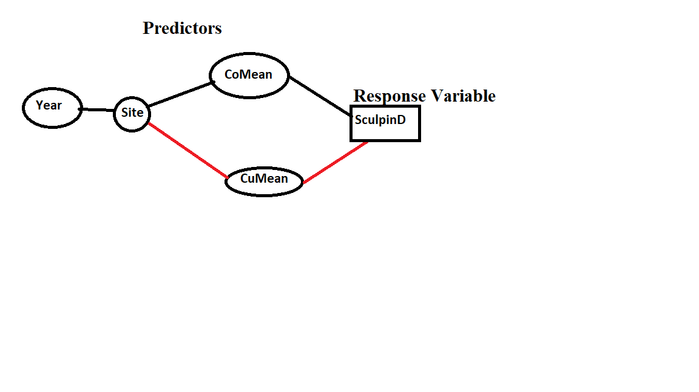

```{r, setup, include = FALSE}
# load packages that are going to be used
require(tidyverse)   # this loads mosaic, ggformula, etc. too
require(ggformula)
require(mosaic)
require(imager)

# Some customization.  You can alter or delete as desired (if you know what you are doing).

theme_set(theme_bw(base_size=12))     # change theme for ggplot2/ggformula

knitr::opts_chunk$set(
  echo = TRUE,      # for homework, always show R code (this is the default)
  tidy = FALSE,     # display code as typed (rather than reformatted)
  size = "small",   # slightly smaller font for code
  message = FALSE, warning = FALSE) # don't print warnings or messages in compiled document. So you MUST check them in RStudio!
```
### Casual diagram



##### All arrows are assumed to go to the right --> (ex: site to CuMean and to sculpinD)


#### This casual diagram demonstrates that my 4 predictors are Year, Site, CoMean, CuMean and my response Variable is SculpinD. the only predicitors I excluded were Biomass and Troutd from the diagram because they do not have relevance to my response variable and would alter the results of sculpinD.
###### Justification:
    -Year: because it is a predictor that will show difference over the course of a time and prove assiocation the most
    -Site: because it is a predictor that will show differences between different sites
    and elaborate to see if location alter association between the two variables
    -CoMean & CuMean: Because it will show us the total amount of copper or cobalt that will 
    assist in ashowing association between both desired variables.
    -SculpinD: this our response variable because it will be altered based on all predictors and will be good measuring tool!
```{r}

creek_data <- read.csv("https://sldr.netlify.app/data/PantherCreek.csv")

```
```{r}
crelr <- lm(SculpinD ~ CuMean + CoMean + Site + Year, data = creek_data )

summary(crelr)
```

#### Equation


linear regression model = SculpinD = -1.236e+04 + 1.389e+00CuMean + 8.639e-02CoMean + 1.523e+01SiteBD + 1.291e+02SiteDE + 6.490e+01SiteNA + 3.760e+01SitePA-km17 + 2.179e+01SitePA-km22 + 1.624e+02SitePA-km37 + 1.021e+02SitePA-km39 + 6.142e+00 Year + $\epsilon$ where $\epsilon$ ~ N(0, 32.37).


Due to the high R-squared value, we can determine that the predictors are altering the response value. hence, giving good confidence that the two variables SculpinD and CoMean are associated.


```{r}
creek_data |>
    mutate(Year_chr = as.character(Year))|>
      gf_point(SculpinD ~ CuMean, 
            data = creek_data, 
            color = ~Year_chr)|>
  gf_labs(subtitle = "Density of Sculpin in correaltion with Copper density",
          title = "Scuplin vs Copper",
          x = " Average Level of Copper",
          y = "Density of Sculpin", 
          color = "Years" )

```


#### Initial assiocation between SculpinD and CoMean 


 As we can observe from the graph, it shows that as the level of cobalt increases, the level of sculptin drastically decreases. This can be an intital sign of assiocation between both variables.
```{r}
s245::gf_acf(~crelr)|>
gf_lims(y=c(-1,1))|>
   gf_labs(subtitle = "Sculptin Vs Copper", title = "Independence Of Residuals", )

```


This graph failed the ACf test and shows us that these two variables most likely have no assiocation. It failed because the lines went beyond the dashed lines after the first line. (However, for the sake of the test we will do all tests!)
```{r}
creek_data <- creek_data |>
mutate(preds = predict (crelr),
resids = resid(crelr))
gf_histogram(~resids, data = creek_data, bins=8)|>
  gf_labs(subtitle = "Sculptin Vs Copper", title = "Histogram: Normality Of Residuals", x = "Residuals" )


```


 This graph doesnt pass because the histogram is mostly skewed right and fails to fall between the necessary boundaries. I do not see a even distrubution that would give me the confidence to say this passed! *grade this one*
```{r}
gf_point(resid(crelr)~fitted(crelr))|>
gf_labs(x = 'Fitted Values', y = 'Residuals')|>
  gf_labs(subtitle = "Sculptin Vs Copper", title = "Non-constant Variance Test", )


```


 Despite the flat edge on the left side, I would gracely say that we could say that this test passed! I can also see that this plotted graph demonstrates a pattern which is consistent with a graph that has constant variance. *grade this*  ( I have observed non constant variance which means that the points are distributed more across the y axis)
```{r}
gf_point(SculpinD ~ CuMean,
         data = creek_data)|>
  gf_labs(subtitle = "Sculptin Vs Copper", title = "Lack of non-linearity Test", )
```


due to the "L" shaped slope, we can see a lack of linearity in our scatter plot. This makes our test failed?!

```{r}
fake_data <- expand.grid(CuMean = seq( from = 0 ,
                                       by  = 0.3 ,
                                       to = 13 ),
                         Year = 2006,
                          CoMean = 0 ,
                           Site = "PA-km39" )
  
  
  
```

```{r}
preds <- predict(crelr, 
                 newdata = fake_data, 
                 se.fit = TRUE)
```


```{r}
fake_data <- fake_data |>
  mutate( pred = predict(crelr,
                         newdata = fake_data))
          
glimpse(fake_data)


```

```{r}

fake_data <- fake_data |>
  mutate (pred = preds$fit,
          pred.se = preds$se.fit)
```


```{r}
fake_data <- fake_data |>
  mutate(CI_lower = pred - 1.96*pred.se,
         CI_upper = pred + 1.96*pred.se)
glimpse(fake_data)
```
```{r}
gf_line(pred ~ CuMean, 
        data = fake_data) |> 
  gf_labs(y='Predicted\nSculptind') |>
  gf_ribbon(CI_lower + CI_upper ~ CuMean)
```


I was doomed from the start! Initially I established that I wanted to see if CuMean and SculptinD had any association. However, after observing multiple Assessment test's failures (like ACF and and the Histogram ), I should have concluded that this test was not advisable. I had to complete all the steps because it was part of this test and in real life circumstances, I would have stopped and looked for different variables to look for association. If the assessments had passed, this type of plotted prediction would have observed that an increase in copper would led to a larger confidence band!   Warning: Any Values that Are Not Shown Were Held Fixed!

```{r}
require(MuMIn)
crelr <- crelr |>
  update(na.action = 'na.fail')
crelr_dredge <- dredge(crelr, rank = 'BIC')
head(crelr_dredge, 4)
```
 My BIC is also a sham because it relies on my Assessments all passing. If my BIC wasn't a sham, I would have looked to see which predictor had the lowest delta and that would have been line 13 in the display!
 
 Conclusion: My work in this test can not be trusted because of initial test failure and no conclusions can be drawn.


  