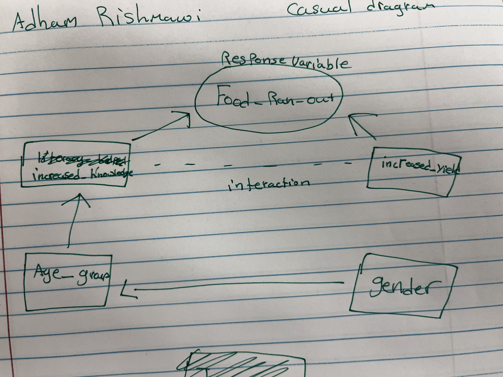

```{r, setup, include = FALSE}
# load packages that are going to be used
require(tidyverse)   # this loads mosaic, ggformula, etc. too
require(ggformula)
require(mosaic)
library("glmmTMB")

# Some customization.  You can alter or delete as desired (if you know what you are doing).

theme_set(theme_bw(base_size=12))     # change theme for ggplot2/ggformula

knitr::opts_chunk$set(
  echo = TRUE,      # for homework, always show R code (this is the default)
  tidy = FALSE,     # display code as typed (rather than reformatted)
  size = "small",   # slightly smaller font for code
  message = FALSE, warning = FALSE) # don't print warnings or messages in compiled document. So you MUST check them in RStudio!
```


###reading in Data-set


```{r}
data1 <- read.csv("https://sldr.netlify.app/data/sustainable-livelihoods.csv")|>
  drop_na(Increased_Yield) |>
  drop_na(Increased_Knowledge)|>
  drop_na(Food_Ran_Out)


```

### question + causual diagram
question: do the programs affect the individual's intellectuality and yield where it makes sure that there is less food deprivation occurring more often. (is there a association between food_ran_out and increased_knowledge and increased_yield?) 




###Justification for predictors and responses


Response variable: the reason I choose Food_Ran_Out is because I want to do binary evaluation because this variable is either no or yes. I had other options such as Months_insufficient_Food but I thought this response variable would be more suitable because it is wthether they completely ran out or not which is more simpler.

Predictors:
-Increased_knowledge & increase_yield: this i thought would be a great predictor to pair up with increase_yield because they are  both are binary options which we can study instances where both are either 1 or zeros and see how they influence my response variable.
-Age-group: this an additional predictor that i thought would influence my response variable because certain ages might be a contributor to the reason why they ran out of food so i included it.
-gender: This was a given because I believed that due to cultural aspects and circumstances that the reason why people would run out of food would be heavily based on their gender. 
- the reason for the exclusion of other predictors: I wanted to stay within the rule of thumb for this test and make sure that my predictors did not go beyond this threshold. Other predictors would have played into distorting the correlation between my response variable and predictors.


###  Inital Graphs

```{r}

int_graph1 <- gf_boxplot(Food_Ran_Out ~ Increased_Knowledge | Increased_Yield ,  data = data1) %>%
  gf_jitter(alpha = 0.3, width = 0.2) %>%
   gf_labs(subtitle = "Initial graph elaborating assiocation between knowledge and the decrease of no food",
          title = "Assiocation Graph for interaction",
          x = " Increase of Knowledge",
          y = "Did they have food?", 
           )

int_graph1

```
```{r}
int_graph2 <- gf_boxplot(Food_Ran_Out ~ Increased_Yield | Increased_Knowledge ,  data = data1) %>%
  gf_jitter(alpha = 0.3, width = 0.2) %>%
   gf_labs(subtitle = "Initial graph elaborating assiocation between Yield and the decrease of no food",
          title = "Assiocation Graph for interaction",
          x = " Increase of Food yield",
          y = "Did they have food?", 
           )

int_graph2
```

###Graph explanation 
Returning to the question we have in mind : 
do the programs affect the individual's intellectuality and yield where it makes sure that there is less food deprivation occurring more often. 
ANSWER: Most definitely yes because we can observe an increase or a difference in the amount of people who had food and did/didnt take the program. I believe this makes my research question a topic worth going into and evaluating. We could conclude hesitantly so far that the programs have caused an increase in knowledge  and yield which has caused a decrease in the amount of food deprived people.

### fitting regression model

```{r}
model_fit <- glmmTMB(factor(Food_Ran_Out) ~ Increased_Knowledge*Increased_Yield + Age_Group + Gender, 
                 data = data1, 
                 family = binomial(link = 'logit'))


msummary(model_fit)
```
### rationale for binary and Logit

1.The reasoning for selecting binary is because my response variable is either 0(No)or 1 (yes) which makes it a great candidate for binary regression model. 
2.the reasoning for using model family logit is because it was what Professor Ruiter suggested we use because
a. it is what the rest of the code we studied was in.
b. it had the best average between cloglog and probit.

### model explanation 


logit(p)=log(p/(1−pi))= beta0 + beta1IFood_deprived + beta1IGender

parameters:
n = number of trials
p = probabilty of success 

(pi/1-pi) = is the odds of success
log = link function
b2x2 + bGxG = number of predictors


###Assesments


```{r}
s245::gf_acf(~model_fit)|>
gf_lims(y=c(-1,1))|>
   gf_labs(subtitle = "Assement1", title = "Independence Of Residuals", )

```


This not good because the lines exceed the dashed lines which means this residual ACf test failed! (issue with indepdence)


```{r}


require(DHARMa)
food_sim <- simulateResiduals(model_fit)

gf_point(food_sim$scaledResiduals ~ rank(predict(model_fit)),
         alpha = 0.2) |>
  gf_labs(x = 'Fitted Values',
          y = 'Scaled Residuals')

```


This absolutely failed the test because a. it is not universally distributed which is the main case. the mean-variance relationship is severely bad here!!!

* after some re-evaluating I can say that this graph is borderline passable because of the uniformately starting from the top right corner! but the left corner concerns me so i would still stick to my initial statement.

### Selection 
```{r}
car::Anova(model_fit)
```


This is not good... We can observe here that there is any indication that there are strong predictors to Food_Ran_out. The best extraction from this Anova is that the best predictor to this prediction plot is Age_Group which makes some sense. It is even hard to determine that there any interaction going on here through the Pr  so I am concerned and know that these predictors dont play into altering food_Ran_Out.


###shortcut pred plot because there is no assiocation between the two
```{r}
pre_preds <- ggeffects::ggpredict(model_fit, c("Increased_Knowledge", "Increased_Yield"))
plot(pre_preds)
```

This is exactly what I expected because I concluded that there is no association between the two variables im evaluating in model assessments and this graph reassures this statement. Here we observed that the red shaded area is within the blue which tells us that there is no intersection hence no interaction!


### Conclusion

restated research question: do the programs affect the individual's intellectuality and yield where it makes sure that there is less food deprivation occurring more often. (is there a association between food_ran_out and increased_knowledge/increased_yield?) 

answer based on initial graph: there was potential because we observed plenty of queues which indicated to the user that there was some kind of assiocation between the interaction I had in mind.

answer based on model assessment: this is where all my confidence was shifted to the worst and I truly observed no association and plenty of model assessments. both tests failed!

answer based on prediction plot:  This graph served as the verification for my selection and model assessment it's failure aligned with the projection I had when I saw the results of the assessments.

answer based on model selection: instantly looking at the model selection process we observed that no correlation or predictors were influencing the response variable we had so I discovered that my initial research question is proven wrong rather then right!!!  


### TEST 3

```{r}
data1RE <- read.csv("https://sldr.netlify.app/data/sustainable-livelihoods.csv")|>
  drop_na(Increased_Yield) |>
  drop_na(Increased_Knowledge)|>
  drop_na(Food_Ran_Out)|>
  arrange(Partner)

```


Model
```{r}
model_fitRan <- glmmTMB(factor(Food_Ran_Out) ~ Increased_Knowledge*Increased_Yield + Age_Group + Gender +
                  (1|Partner), 
                 data = data1RE, 
                 family = binomial(link = 'logit'),
                 na.action = 'na.fail',
                 REML = FALSE)


msummary(model_fitRan)
```
 My Random effects is Partner
 
 
Rationale = The logic for the predictors still remains the same. However, the Random effects I based it on The Partner because i believed it would be a bad traditional predictor because all the Organizations included have the same goal so theoretical it should be a bad predictor. It also fits the criteria we said in class that it must be a location, time, or identity which it is. I did not get any covergance problems so that's a good identification that it is a good RE effect

SUMMARY EXPLANATION

Random effect variance estimate was overall good showing that the inclusion of partner is correct based on the STd. dev.

Partner (intercept) 1.669 Variance 1.292 std. Dev
number of obs: 188, groups: Partner, 10

DREDGE
```{r}
require(MuMIn)
dredged <- dredge(model_fitRan, rank = 'BIC')
head(dredged)
```


ASSESSMENT

before random effects:
```{r}
s245::gf_acf(~model_fit)|>
gf_lims(y=c(-1,1))|>
   gf_labs(subtitle = "Assement1", title = "Independence Of Residuals", )

```


The Conditions here are barely meet because the lines passes the dashed lines indicating a hesitant conclusion that it failed.


After Random effects:

```{r}
s245::gf_acf(~model_fitRan)|>
gf_lims(y=c(-1,1))|>
   gf_labs(subtitle = "Assement1", title = "Independence Of Residuals", )

```
This makes me happy because the  RE ACF test tells us that the inclusion of Partner is most likely a right decision as a RE. We can observe that ACF is not passing any thresholds whereas the ACF in the previous one is passing a couple of times. This test passes


```{r}
food_sim <- simulateResiduals(model_fitRan)
gf_point(food_sim$scaledResiduals ~ fitted(model_fitRan),
alpha = 0.2) %>%
gf_labs(
y = 'Scaled Residuals')

```


As an additional test: Mean variance relationship looks great because we see a vertical relationship with minimal clustering in it. yay!


Predictions


```{r}
require(ggeffects)
ggpredict(model_fitRan, 
          c("Increased_Knowledge", "Increased_Yield"), 
          type = 're') |> 
  plot() 
```

I feel that this prediction plot demonstrates a better interaction than what we had in the previous test because it is showing us what we want to see in a interaction predictors. This is also a individual Average rather than population due to the dredge suggesting that a individual average is better.

CONCLUSION

restated question: do the programs affect the individual's intellectuality and yield where it makes sure that there is less food deprivation occurring more often. (is there a association between food_ran_out and increased_knowledge/increased_yield?) 

Answered based on previous test: can not be concluded from the results of the previous test to say that increased knowledge and increased yield resulted in less food deprivation if anything it could not be trusted for anything.

Answered based on this test: I can say more confidently  that i can see that the interaction is giving us some insight that they might lead us to think that food deprivation occurs less. I would stick to these results because it gives a more affirmative result with appropriate measures followed. The prediction plot is completely different and is showing a  interaction.


BONUS

thoughts on the test format: I think if anything these tests give us a taste of reality of how real-life projects will go and I enjoy how it minimizes dependence by giving us our own trajectory. They are good! Please keep this format for the future! 


 
  