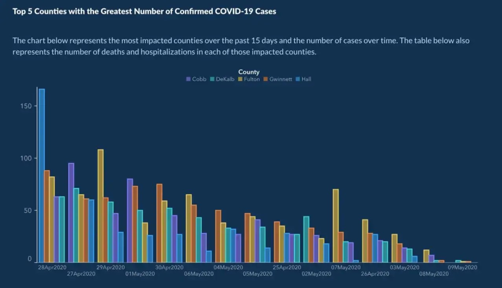

```{r setup, include=FALSE}
# Set some useful chunk options for code chunks.
knitr::opts_chunk$set(
  echo = TRUE,
  error = TRUE,    # display errors but keep going.
  comment = "",    # don't add '##' characters before output.
  message = FALSE  # don't include messages in the knitted output (check them in RStudio)
  )
library(tidyverse)
theme_set(theme_bw())
```

## My Data set

https://www.covid-georgia.com/archive/did-georgia-graph-cases-with-the-dates-out-of-order/

```{r change-my-name}
potential_data <- read.csv("~/data202/Mid 1/owid-covid-data (1).csv")
glimpse(potential_data)
```


## Claim
Does Covid-19 differ in infection rates from country to country? (Egypt vs Jordan vs Israel?)


## Structure of data
This data consists of plenty of numerical and categorical variables (34 to be precise). The data set also consists of plenty of observations which amount to 189999!

* I do not intend to use all the variables in my graph but they are very valuable and understandable!*
